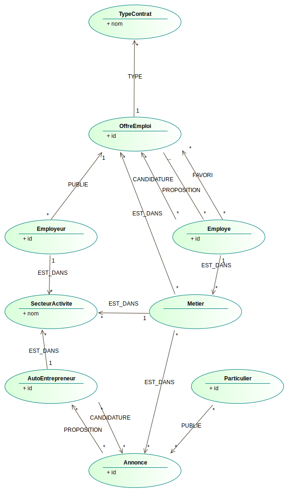
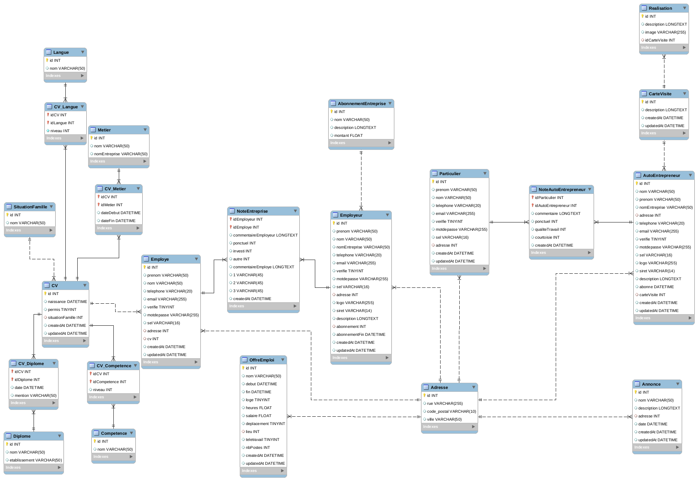

# Feeljob

Site de mise en relation entre chercheurs d'emplois et entreprise, mais aussi entre particuliers et auto-entrepreneurs.

Ce projet a été réalisé dans le cadre du module info608 de licence 3 d'informatique de l'université Savoie Mont Blanc par Kevin Traini, Luca Ciampi et Florian Deschenaux.

## Installation

### Prérequis

Pour faire fonctionner le site sur votre machine ou sur serveur, il faut :

- [Composer](https://getcomposer.org/)
- [Mysql](https://www.mysql.com/fr/)
- [Neo4j](https://neo4j.com/)

### Installation

Après avoir installé les prérequis et cloné le dépôt git, il faut installer les packages. Pour cela, ouvrez la console et tapez :

`.../Feeljob $ composer update`

Une fois les téléchargements terminés, il faut initialiser les bases de données. Commençons par neo4j.

Tout d'abord il faut allumer le serveur neo4j `neo4j start`, puis s'y connecter `cypher-shell` ou http://localhost:7474. Les identifiants de base sont `neo4j:neo4j`. On peut maintenant créer l'utilisateur et la base de données :

```cypher
CREATE USER feel SET PASSWORD 'feel' CHANGE NOT REQUIRED;
GRANT ROLE publisher TO feel;
CREATE DATABASE feeljob;
```

Si vous faites `SHOW DATABASES` et `SHOW USERS` vous devriez voir vos modifications.

Nous avons terminé avec neo4j, passons à mysql. Connecter vous à mysql de votre manière préférée, puis saisissez ces requêtes :

```mysql
CREATE USER `feeljob`@`localhost` IDENTIFIED WITH mysql_native_password BY 'feeljob';
GRANT ALL PRIVILEGES ON *.* TO `feeljob`@`localhost`;
FLUSH PRIVILEGES;
SELECT user,host FROM mysql.user;
```

La dernière requête devrait vous renvoyer tous les utilisateurs mysql dont celui qu'on vient de créer.

Bien sûr, libre à vous de modifier les identifiants de chaques utilisateurs, mais pensez bien à reporter ces modifications dans le `.env` pour mysql et dans `src/database/Connection.php` pour neo4j.

Il reste quelques commandes en console pour en finir avec mysql.

```shell
php bin/console doctrine:database:create
php bin/console doctrine:migrations:migrate
php bin/console doctrine:migrations:list
```

Sur la dernière commandes vous devriez voir un tableau, s'il n'y pas de `migrated` pour chaque ligne, répétez la deuxième commande jusqu'à ce que le tableau soit bon.

Maintenant il faut remplir les bases de données avec les données de bases. Tout d'abord il faut allumer le site, si vous êtes sur serveur il n'y a pas grand chose à faire, sur votre machine 2 options : 

- installer l'exécutable symfony et faire `symfony serve`
- faire `php -S 127.0.0.1:8000 -t public/`

Après allez à l'adresse `/utils/fill`, la page devrait vous renvoyer un json avec la valeur filled, si vous actualisez la page, ce sera already_filled.

## Documentation Ajax

Toutes les requêtes Ajax doivent se faire en **POST**

La doc est formée de cette manière :
`url` *=>* description *=>* `résultat {'nom': type}`

---

### Partie Particulier
- `/particulier/candidate/{id}` *=>* L'AutoEntrepreneur candidate à l'Annonce id *=>* `{'result': boolean}`
- `/particulier/uncandidate/{id}` *=>* L'AutoEntrepreneur supprime sa candidature à l'Annonce id *=>* `{'result': boolean}`
- `/particulier/refuse/candidature/{idAnn}/{idAuto}` *=>* Le Particulier refuse la candidature de l'AutoEntrepreneur idAuto à l'Annonce idAnn *=>* `{'result': boolean}`
- `/particulier/propose/{idAnn}/{idAuto}` *=>* Le Particulier propose l'Annonce idAnn à l'AutoEntrepreneur idAuto *=>* `{'result': boolean}`
- `/particulier/remove/proposition/{idAnn}/{idAuto}` *=>* Le Particulier supprime la proposition d'Annonce idAnn faite à l'AutoEntrepreneur idAuto *=>* `{'result': boolean}`
- `/particulier/refuse/proposition/{id}` *=>* L'AutoEntrepreneur refuse la proposition de l'Annonce id *=>* `{'result': boolean}`
- `/particulier/add/favoris/{id}` *=>* L'AutoEntrepreneur mets l'Annonce id en favoris *=>* `{'result': boolean}`
- `/particulier/remove/favoris/{id}` *=>* L'AutoEntrepreneur enlève l'Annonce id de ses favoris *=>* `{'result': boolean}`
- `/particulier/accept/proposition/{id}` *=>* L'AutoEntrepreneur accept la proposition de l'Annonce id *=>* `{'result': boolean}`
- `/particulier/accept/candidature/{idAnn}/{idAuto}` *=>* Le Particulier accepte la candidature de l'AutoEntrepreneur idAuto à l'Annonce idAnn *=>* `{'result': boolean}`
- `/particulier/get/candidatures` *=>* L'AutoEntrepreneur récupère toutes ses candidatures *=>* `{'candidatures': Annonce[]}`
- `/particulier/get/my/candidatures` *=>* Le Particulier récupère toutes ses candidatures *=>* `{'candidatures': ['annonce': Annonce, 'auto': AutoEntrepreneur]}`
- `/particulier/get/accepted/candidatures` *=>* L'AutoEntrepreneur récupère toutes ses candidatures acceptées *=>* `{'candidatures': Annonce[]}`
- `/particulier/get/accepted/my/candidatures` *=>* Le Particulier récupère toutes ses candidatures acceptées *=>* `{'candidatures': ['annonce': Annonce, 'auto': AutoEntrepreneur]}`
- `/particulier/get/propositions` *=>* L'AutoEntrepreneur récupère toutes ses propositions *=>* `{'propositions': Annonce[]}`
- `/particulier/get/my/propositions` *=>* Le Particulier récupère toutes ses propositions *=>* `{'propositions': ['annonce': Annonce, 'auto': AutoEntrepreneur]}`
- `/particulier/get/accepted/propositions` *=>* L'AutoEntrepreneur récupère toutes ses propositions acceptées *=>* `{'propositions': Annonce[]}`
- `/particulier/get/my/accepted/propositions` *=>* Le Particulier récupère toutes ses propositions acceptées *=>* `{'propositions': ['annonce': Annonce, 'auto': AutoEntrepreneur]}`
- `/particulier/get/favoris` *=>* L'AutoEntrepreneur récupère toutes ses Annonces en favoris *=>* `{'favoris': Annonce[]}`
- `particulier/get/annonces/{nom}/{metier}/{departement}/{limit}/{offset}` *=>* L'AutoEntrepreneur récupère toutes les annonces se nommant nom de Metier dans un département. Il récupère limit annonces avec un offset *=>* `{'annonces': Annonce[]}`
- `/particulier/get/cartes/{nom}/{metiers}/{distanceMax}/{limit}/{offset}` *=>* Le particulier récupère toutes les CarteVisite selon le nomEntreprise nom, les metiers et la distanceMax. Il en récupère limit avec un offset *=>* `{'cartes': CarteVisite[]}`

---

### Partie Entreprise
- `/entreprise/candidate/{id}` *=>* L'Employe candidate à l'OffreEmploi id *=>* `{'result': boolean}`
- `/entreprise/uncandidate/{id}` *=>* L'Employe supprime sa candidature à l'OffreEmploi id *=>* `{'result': boolean}`
- `/entreprise/refuse/candidature/{idO}/{idE}` *=>* L'Employeur refuse la candidature de l'Employe idE à l'OffreEmploi idO *=>* `{'result': boolean}`
- `/entreprise/propose/{idO}/{idE}` *=>* L'Employeur propose l'OffreEmploi idO à l'Employe idE *=>* `{'result': boolean}`
- `/entreprise/remove/proposition/{idO}/{idE}` *=>* L'Employeur supprime sa proposition d'OffreEmploi idO à l'Employe idE *=>* `{'result': boolean}`
- `/entreprise/refuse/proposition/{id}` *=>* L'Employe refuse la proposition d'OffreEmploi id *=>* `{'result': boolean}`
- `/entreprise/add/favoris/{id}` *=>* L'Employe rajoute l'OffreEmploi id à ses favoris *=>* `{'result': boolean}`
- `/entreprise/remove/favoris/{id}` *=>* L'Employe enlève l'OffreEmploi id de ses favoris *=>* `{'result': boolean}`
- `/entreprise/accept/proposition/{id}` *=>* L'Employe accepte la proposition d'OffreEmploi id *=>* `{'result': boolean}`
- `/entreprise/accept/candidature/{idO}/{idE}` *=>* L'Employeur accepte la candidature de l'Employe idE sur l'OffreEmploi idO *=>* `{'result': boolean}`
- `/entreprise/get/candidatures` *=>* L'Employe récupère toutes ses candidatures *=>* `{'candidatures': OffreEmploi[]}`
- `/entreprise/get/my/candidatures` *=>* L'Employeur récupère toutes ses candidatures *=>* `{'candidatures': ['offre': OffreEmploi, 'employe': Employe, 'cv': CV]}`
- `/entreprise/get/accepted/candidatures` *=>* L'Employe récupère toutes ses candidatures acceptées *=>* `{'candidatures': OffreEmploi[]}`
- `/entreprise/get/my/accepted/candidatures` *=>* L'Employeur récupère toutes ses candidatures acceptées *=>* `{'candidatures': ['offre': OffreEmploi, 'employe': Employe, 'cv': CV]}`
- `/entreprise/get/propositions` *=>* L'Employe récupère toutes ses propositions *=>* `{'propositions': OffreEmploi[]}`
- `/entreprise/get/my/propositions` *=>* L'Employeur récupère toutes ses propositions *=>* `{'propositions': ['offre': OffreEmploi, 'employe': Employe, 'cv': CV]}`
- `/entreprise/get/accepted/propositions` *=>* L'Employe récupère toutes ses propositions acceptées *=>* `{'propositions': OffreEmploi[]}`
- `/entreprise/get/my/accepted/propositions` *=>* L'Employeur récupère toutes ses propositions acceptées *=>* `{'propositions': ['offre': OffreEmploi, 'employe': Employe, 'cv': CV]}`
- `/entreprise/get/favoris` *=>* L'Employe récupère tous ses favoris *=>* `{'favoris': OffreEmploi[]}`
- `/entreprise/get/cvs/{metiers}/{nom}/{competences}/{langues}/{permis}/{limit}/{offset}` *=>* L'Employeur récupère tout les CV selon les metiers, le nom, les competences, langues et permis. Il récupère limit CV avec un offset *=>* `{'cvs': CV[], 'quantity': Int}`
- `/entreprise/get/offres_emploi/{nom}/{metier}/{typeContrat}/{secteurActivite}/{departement}/{loge}/{deplacement}/{teletravail}/{limit}/{offset}` *=>* L'Employe récupère toutes les OffreEmploi selon le nom, typeContrat, metier, secteur, departement, loge, deplacement, teletravail. Il en récupère limit avec un offset *=>* `{'offres': OffreEmploi[], 'quantity': Int}`

## Documentation routes

Les routes sont formées de cette manière :
`url` *=>* description *=>* `nom`

---

- `/` *=>* page d'accueil *=>* `homepage`
- `/connexion` *=>* formulaire de connexion *=>* `connexion`
- `/deconnexion` *=>* déconnexion *=>* `deconnexion`
- `/supprimer/compte` *=>* suppression du compte *=>* `delete_account`
- `/userspace` *=>* redirection vers l'espace utilisateur *=>* `userSpace`
- `/inscription` *=>* choix entre inscription entreprise ou particulier *=>* `inscription`
- `/mail_verifie` *=>* l'email a été vérifié *=>* `mailVerified`
- `/verification/{id}` *=>* on attend que l'email du compte id soit vérifié *=>* `waitVerifEmail`
- `/verif/{id}` *=>* Mets l'email du compte id en vérifié *=>* `verifEmail`
- `/contact` *=>* nous contacter *=>* `contact`
- `/developpeurs` *=>* nous *=>* `developers`
- `/cookies` *=>* les cookies *=>* `cookies`
- `/confidentialite` *=>* des règles *=>* `confidentiality`
- `/conditions` *=>* des règles *=>* `conditions`
- `/voir/{type}` *=>* affiche les détails de type *=>* `show`
- `/mdp_oublie` *=>* quand on a oublié son mdp *=>* `mdpOublie`
- `/reinitialiser_mdp` *=>* pour réinitialiser son mdp *=>* `mdpReinitialiser`
- `/ajout/credits` *=>* Permet à l'auto-entrepreneur ou à l'employeur d'acheter des crédits *=>* `ajoutCredits`

---

### Partie Entreprise
- `/entreprise/inscription/employeur` *=>* inscription partie entreprise *=>* `entreprise_inscription_employeur`
- `/entreprise/inscription/employe` *=>* inscription partie entreprise *=>* `entreprise_inscription_employe`
- `/entreprise/mon_espace` *=>* espace utilisateur *=>* `entreprise_espace`
- `/entreprise/creer/CV` *=>* L'Employe créé son CV *=>* `entreprise_create_cv`
- `/entreprise/modifier/CV/{id}` *=>* L'Employe modifie son CV id *=>* `entreprise_modifier_cv`
- `/entreprise/supprime/CV/{id}` *=>* L'Employe supprime son CV id *=>* `entreprise_delete_cv`
- `/entreprise/cv/{id}` *=>* Montre les détails du cv id *=>* `entreprise_show_cv`
- `/entreprise/cvs` *=>* Liste des CVs *=>* `entreprise_cvs`
- `/entreprise/creer/offre_emploi` *=>* L'Employeur créé une OffreEmploi *=>* `entreprise_create_offre_emploi`
- `/entreprise/modifier/offre_emploi/{id}` *=>* L'Employeur modifie l'OffreEmploi id *=>* `entreprise_modify_offre_emploi`
- `/entreprise/supprime/offre_emploi/{id}` *=>* L'Employeur supprime son OffreEmploi id *=>* `entreprise_delete_offre_emploi`
- `/entreprise/offre_emploi/{id}` *=>* Montre les détails de l'OffreEmploi id *=>* `entreprise_show_offre_emploi`
- `/entreprise/contrats` *=>* Montre les contrats de l'utilisateur *=>* `entreprise_contrats`

---

### Partie Particulier
- `/particulier/inscription/particulier` *=>* inscription partie particulier *=>* `particulier_inscription_particulier`
- `/particulier/inscription/auto` *=>* inscription partie particulier *=>* `particulier_inscription_auto`
- `/particulier/mon_espace` *=>* espace utilisateur *=>* `particulier_espace`
- `/particulier/creer/carte` *=>* l'AutoEntrepreneur créé sa carte de visite *=>* `particulier_create_carte`
- `/particulier/modifier/carte/{id}` *=>* l'AutoEntrepreneur modifie sa carte de visite *=>* `particulier_modifier_carte_visite`
- `/particulier/supprimer/carte/{id}` *=>* l'AutoEntrepreneur supprime sa carte de visite *=>* `particulier_delete_carte`
- `/particulier/creer/annonce` *=>* le Particulier créé une annonce *=>* `particulier_create_annonce`
- `/particulier/modifier/annonce/{id}` *=>* Le Particulier modifie son annonce id *=>* `particulier_modifier_annonce`
- `/particulier/supprimer/annonce/{id}` *=>* Le Particulier supprime son annonce id *=>* `particulier_delete_annonce`
- `/particulier/annonces` *=>* Liste des annonces *=>* `particulier_annonces`
- `/particulier/annonce/{id}` *=>* Montre l'annonce id *=>* `particulier_show_annonce`
- `/particulier/carte/{id}` *=>* Montre les détails de la CarteVisite id *=>* `particulier_show_carte`
- `/particulier/cartes` *=>* Liste des CarteVisite *=>* `particulier_cartes`
- `/particulier/contrats` *=>* Montre les contrats de l'utilisateur *=>* `particulier_contrats`

## Documentation bdd

### Neo4j


---

### Mysql

